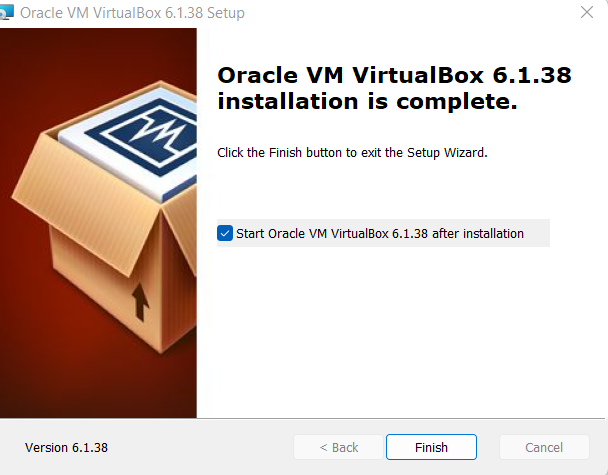

# Implementing-Identity-and-Access-Management-using-ForgeRock
**This project presents how to implement IAM using Forgerock**
##Project Pre-requsite##
To begin the project I installed Oracle virtual box using this
<a href="https://www.virtualbox.org">link</a>
For this project , I will downloaded the VirtualBox 6.1.38 (this is the latest version when I was completed this lab. feel free to latest version when completing your labv1.
  
